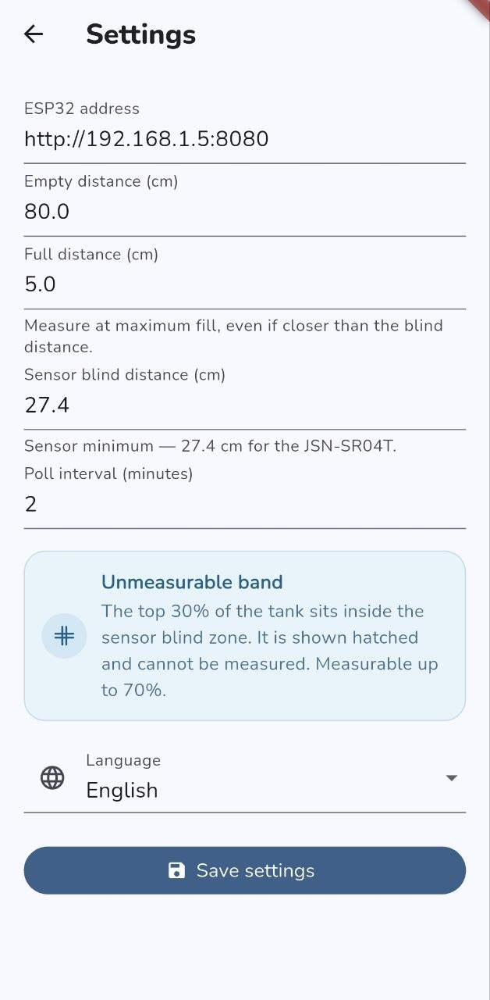
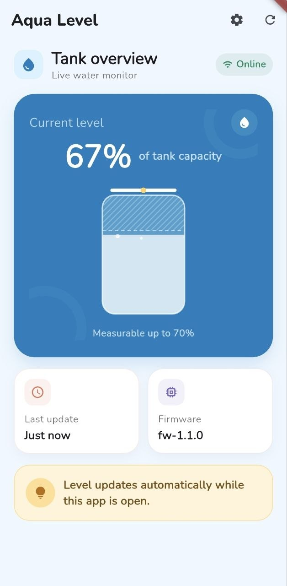

# water-tank-level

A personal water tank monitor built to save me from climbing upstairs to check the tank manually, especially when the weather is too cold or too hot.

The project uses an ESP32 and a JSN-SR04T ultrasonic sensor to measure the water level and a Flutter app to display it over the local network.

## Features

- Configurable tank and sensor settings
- Sensor blind-zone handling
- Live water-level monitoring from the app
- ESP32 firmware updates over WiFi with OTA

## App

## Project layout

- `lib/` contains the Flutter app
- `esp32/` contains the Arduino firmware
- `tools/` contains development and sensor data collection tools

See [README.development.md](README.development.md) for setup, firmware, and data collection details.
